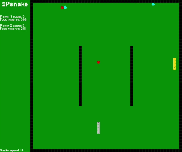

# 2p_snak

Hello fellow earthlings!

This is a tweakable 2 (or 1) player snake game that I coded with python pygame library to try out machine learning on. Specifically I chose NEAT algorithm, since it seemed elegant, well documented and most importantly I found it cool that it's so similar to evolution.

This is the result:

  <picture>
    
  </picture>

I started out from this example https://www.youtube.com/watch?v=CD4qAhfFuLo for snake part of code and https://www.youtube.com/watch?v=MMxFDaIOHsE&list=PLzMcBGfZo4-lwGZWXz5Qgta_YNX3_vLS2&index=1 for overview of NEAT functionality and upgraded/polished the code to suit my needs.
Best place to consult in case something goes awry is still the documentation of respective modules.

Useful links:

Pygame module: https://www.pygame.org/wiki/GettingStarted 

Neat module: https://neat-python.readthedocs.io/en/latest/installation.html

Visualize module: https://github.com/CodeReclaimers/neat-python/blob/master/examples/xor/visualize.py

Graphviz installation: https://pypi.org/project/graphviz/

Feel free to do anything with this. 

